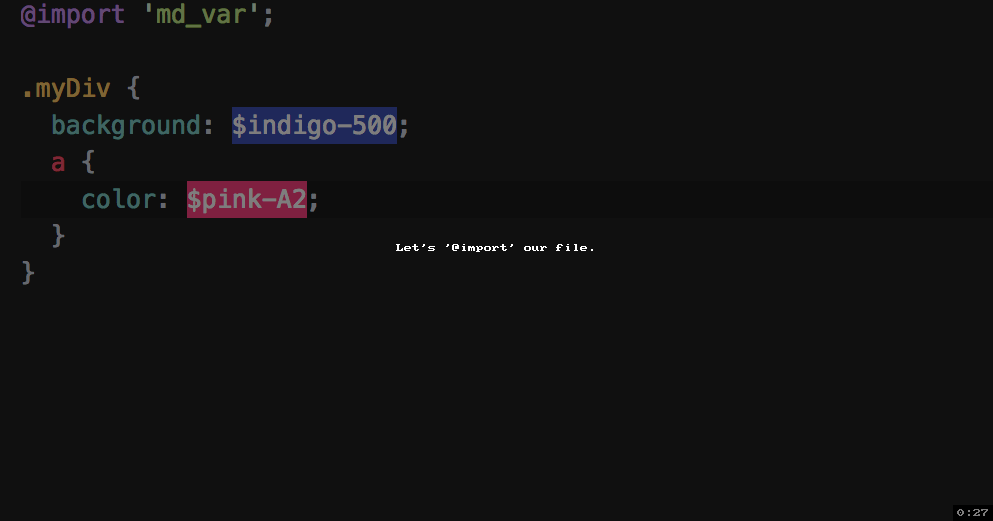

# Material-Design-Colors
Set of Material Design palette (by Google) into SASS variables!


|  Index  |
| :---: |
| [USAGE](https://github.com/Rawnly/Material-Design-Colors-SASS#usage)  |
|  [EXAMPLE](https://github.com/Rawnly/Material-Design-Colors-SASS#example)  |
|  [EXTRA](https://github.com/Rawnly/Material-Design-Colors-SASS#extra)  | 


## Usage
Just `@import` the file and that's it!

#### Code:
```sass
  // style.scss
  @import '../path/to/md_variables';

```

#### Example:
<p align="center">
  
</p>

#### Palette List
* Red
* Pink
* Purple
* Dark Purple
* Indigo
* Blue
* Light Blue
* Cyan
* Teal
* Green
* Light Green
* Lime
* Yellow
* Amber
* Orange
* Dark Orange
* Brown
* Gray
* Blue Gray
* White
* Black

# Extra
* Coded with [Atom](https://atom.io)
* Palette source [here][source]

<!-- URLS  -->
[source]: https://material.google.com/style/color.html#
